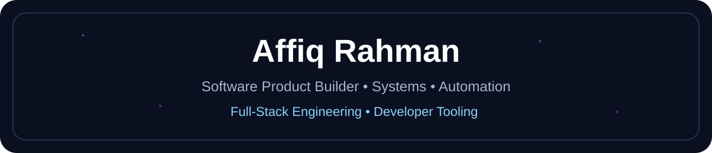

  

<h1 align="center">Hi, I'm Affiq Rahman 👋</h1>

  <strong>Web Developer • Laravel Backend • Modern Frontend • Business Websites • Mini Systems</strong>

  I build practical, clean, and business-focused websites and web systems for real-world use.

  <a href="https://affiqrahman.com">Website</a> •
  <a href="https://www.linkedin.com/in/affiqrahman/">LinkedIn</a> •
  <a href="https://www.youtube.com/@affiqrahman">YouTube</a>

---

## About Me

I'm a web developer focused on building practical websites, backend systems, and mini digital tools for businesses.

My work includes custom frontend development, Laravel backend systems, database workflows, API structure, contact forms, admin dashboards, QR-based customer flows, and business-focused web solutions.

I have worked with traditional web stacks like HTML, CSS, JavaScript, PHP, Laravel, and MySQL, while also building and exploring modern frontend tools such as React, Next.js, TypeScript, and Tailwind CSS.

I enjoy turning real business problems into clean digital systems that are simple to use, easy to maintain, and built with trust and clarity.

---

## What I Build

- Business websites
- Landing pages
- Laravel backend systems
- Contact form systems
- Admin submission dashboards
- API-based workflows
- QR menu and ordering flows
- Mini business systems
- Website cleanup and technical fixes
- Website security improvements
- Simple automation flows for business operations
- AI-assisted content and workflow systems

---

## Current Focus

### ORDERra

A restaurant ordering system portfolio project focused on real-world customer flow.

Core features include:

- QR menu flow
- Customer cart
- Pricing quote
- Checkout process
- Payment simulation
- Delivery, pickup, and dine-in options
- Order tracking
- Support ticket flow
- Admin-ready backend structure

This project is built to demonstrate practical backend logic, API structure, customer flow, and business-focused system design.

---

## Tech Stack & Tools

### Core Web Development

  
  
  
  

### Modern Frontend

  
  
  
  
  

### Backend & Database

  
  
  
  

### Python & Automation

  
  
  
  

### API Testing & Package Tools

  
  
  
  

### Tools, Design & Deployment

  
  
  
  
  
  
  

### Systems I Build

  
  
  
  
  
  
  
  
  

---

## Developer Direction

I focus on building websites and systems that are:

- Clean
- Practical
- Secure
- Easy to maintain
- Useful for real business operations
- Designed with trust and clarity

My goal is to create web solutions that help business owners look more professional, receive customer enquiries, manage submissions, and improve their online presence.

---

## Website Services I Care About

I am especially interested in helping small businesses with:

- Website repair
- Contact form fixes
- WhatsApp button fixes
- QR menu setup
- Simple business websites
- Website maintenance
- Mini internal systems
- Admin submission systems
- Business workflow automation

---

## Useful Snippets

I also document useful developer and computer workflow notes.

- [Windows God Mode Shortcut](snippets/windows-godmode.md)

---

## Creator Side

Outside of web development, I also create music under:

**ZyloChord | by Affiq Rahman**

This creative side helps me explore branding, mood, storytelling, and digital presentation.

YouTube:  
https://www.youtube.com/@affiqrahman

---

## Main Website

https://affiqrahman.com

---

  <strong>Building practical websites, backend systems, and mini digital tools for real businesses.</strong>

